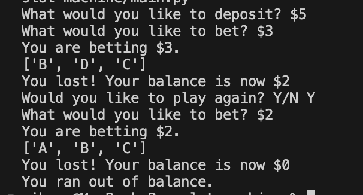

# Python Slot Machine Project

Welcome to my Python Slot Machine project! This project demonstrates my understanding of Python programming by implementing a simple slot machine game.

## Description

This project is a console-based implementation of a slot machine game. It serves as a demonstration of my proficiency in Python programming, including concepts such as functions, loops, and basic game logic.

## Features

- Beginner-friendly codebase.
- Built solely with Python, showcasing my Python programming skills.

## How to Play

1. Clone or download the project repository to your local machine.
2. Make sure you have Python installed.
3. Navigate to the project directory in your terminal or command prompt.
4. Run the Python script `slot_machine.py`.

## Technologies Used

- Python
